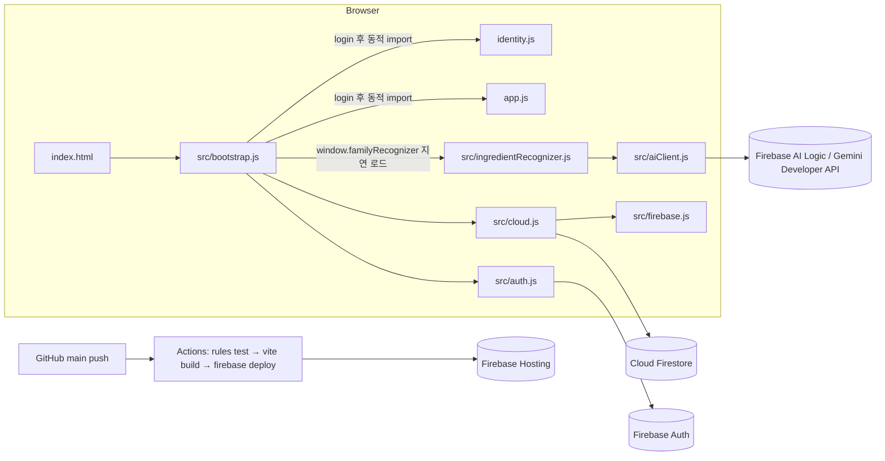

# LEE_FAMILY 개발 인계 문서 (2026-09-28 기준)

다음 작업자(사람 또는 AI 모델)가 이 문서만 읽고 바로 이어서 개발할 수 있도록 정리했습니다. 구성은 다음 순서입니다.

1. 제품 목적
2. 아키텍처
3. 데이터와 보안
4. 기능별 구현 목적, 구현 방식, 설계 판단
5. 코드 수정 규칙
6. 테스트와 배포
7. 보류된 작업 (마트 / Budget 탭)

기존 요약 문서는 [HANDOFF.md](../HANDOFF.md), 운영·설정 방법은 [README.md](../README.md)에 있습니다. 이 문서가 가장 최신이며 가장 자세합니다.

---

## 0. 한눈에 보기

| 항목 | 값 |
| --- | --- |
| 서비스 | 가족 공유 웹앱 (냉장고·추천 메뉴·가족 일정·집안일·공지) |
| 운영 URL | https://lee-house-0905.web.app |
| 저장소 | `2-sohee/lee_family` (public) |
| 스택 | Vanilla HTML/CSS/JS + Vite 7, Firebase 12 (Auth, Firestore, Hosting, AI Logic) |
| Firebase 프로젝트 | `lee-house-0905`, Spark(무료) 플랜. Cloud Functions 없음 |
| 배포 | `main`에 push하면 GitHub Actions가 규칙 테스트 → 빌드 → Hosting과 Firestore 규칙 배포 |
| 계정 | 시스템 관리자 `admin` / `admin!` (이름 `관리자`, 고정). 가족 계정은 관리자가 `설정`에서 생성 |
| 현재 가족 데이터 | `families/lee` 구성원: admin(관리자), ddoing(또잉이), sora(또랑이) |
| 보류된 작업 | 마트·Budget 탭. 구현 코드는 `wip/mart-budget` 브랜치에 보관 (7장) |

### 작업 이력

| PR / 커밋 | 내용 |
| --- | --- |
| #1 | Firebase Auth·Firestore·Hosting 배포, GitHub Actions CI |
| #2 | 모바일 하단 탭 수정, 냉장고 기반 추천, AI 사진 재료 인식, 관리자 고정·`설정` 페이지 |
| #3 | 가족 일정 기간(시작~종료) 등록, AI 인식 재시도·오류 안내 개선 |
| 이번 PR | 추천 메뉴 색상·5개 제한, 냉장고 재료 수정·삭제, 인식 후 사진 자동 정리, 일정 앞뒤 3개월, AI 공통 모듈 분리, E2E 스모크 테스트, 이 문서 |

---

## 1. 제품 목적과 사용자

- **목적:** 한 가족이 냉장고 재료, 일정, 집안일, 공지를 한곳에서 실시간으로 공유합니다. 휴대폰(iPhone Safari, Galaxy 삼성 인터넷·Chrome)에서 쓰는 것이 기본입니다.
- **사용자 구분**
  - **가족 구성원 (role `user`):** 모든 공유 기능을 사용하고, `내 프로필`에서 이름·색상·비밀번호를 바꿉니다.
  - **시스템 관리자 (role `admin`):**
    - 가족이 아니라 시스템을 관리하는 역할입니다.
    - 가족 목록, 일정·집안일 담당자, 가족 카드 같은 공유 영역에 **나타나지 않습니다.**
    - `내 프로필` 대신 `설정` 메뉴만 있습니다.
    - 공지 작성자는 `관리자`로 표시됩니다.
- **회원가입 없음:** 관리자가 계정을 만들어 가족에게 아이디와 비밀번호를 알려줍니다.

---

## 2. 아키텍처



### 2.1 로딩 흐름

1. `index.html`은 앱 쉘(사이드바/하단 탭, 헤더, `#app-view`, `#modal-root`)만 들고 있고 `src/bootstrap.js`만 로드합니다.
2. `bootstrap.js`의 순서:
   - 로그인 화면을 그리고, `authService`로 로그인합니다.
   - `startCloud()`로 Firestore 실시간 구독을 시작합니다.
   - `window.familyCloud`를 노출한 뒤 `identity.js`와 `app.js`를 **동적 import**합니다.
3. AI 모듈은 무겁기 때문에(약 38kB) `window.familyRecognizer.recognize()`를 처음 호출할 때 동적 import합니다.

### 2.2 모듈 책임

| 파일 | 책임 |
| --- | --- |
| `src/firebase.js` | `VITE_FIREBASE_*` 값으로 초기화하고 에뮬레이터를 연결합니다. `firebaseApp`, `db`, `familyId`를 export합니다 |
| `src/auth.js` | 아이디와 내부 이메일을 변환합니다(`mom` → `mom@lee-family.example.com`). 로그인, 보조 앱 인스턴스로 계정 생성, 비밀번호 변경을 맡습니다 |
| `src/cloud.js` | 가족 문서, `members`, `state/*`, `fridgePhotos`를 구독하고 `saveState()`로 저장합니다. 변경이 있으면 `onChange(type)`을 발행합니다 |
| `src/photoStorage.js` | 사진을 축소하고 JPEG로 압축합니다(Firestore 1MiB 문서 제한 대응). 최대 4장입니다 |
| `src/aiClient.js` | **(이번 추가)** Gemini 모델 체인, 재시도와 폴백, HTTP 상태별 한국어 오류 메시지를 맡습니다 |
| `src/ingredientRecognizer.js` | 사진 → 재료 JSON(responseSchema)을 만들고, 정규화와 중복 제거를 합니다 |
| `identity.js` | 상단 프로필 영역과 브랜드, `내 프로필`(user)과 `설정`(admin) 화면을 맡습니다. `familyOnly()`로 관리자를 공유 영역에서 제외합니다 |
| `app.js` | 대시보드, 냉장고, 추천 메뉴, 일정, 집안일, 공지 화면을 렌더링합니다. 모든 뷰와 모달이 여기에 있습니다 |
| `styles.css` | 전체 스타일. 파일 끝에 기능별 블록이 순서대로 추가되어 있습니다(모바일 블록 → 인식/추천 → 이번 작업) |
| `firestore.rules` | 보안 규칙. 테스트는 `tests/firestore.rules.test.js`에 있습니다 |
| `tests/e2e/smoke.e2e.cjs` | **(이번 추가)** 모바일 E2E 스모크 테스트 (6.2) |

### 2.3 전역 브리지

모듈끼리는 `window`에 노출한 객체로 통신합니다.

| 전역 | 제공처 | 용도 |
| --- | --- | --- |
| `window.familyCloud` | bootstrap/cloud | `state`, `settings`, `saveState()`, `onChange()`, 계정 API |
| `window.familyIdentity` | identity.js | `current()`, `isAdmin()`, `members()` (관리자 제외 목록) |
| `window.familyRecognizer` | bootstrap | `recognize(dataUrls)` → `[{name, emoji, qty, place, expiryDays, confidence}]` |
| `window.familyPhotoStorage` | bootstrap | `photoLimits`, `readPhoto(file)` |
| `window.familyToast(msg)` | bootstrap | 하단 토스트 |
| `window.layout()` | app.js | 현재 뷰를 다시 렌더링 |

E2E 테스트는 `window.familyRecognizer`를 바꿔 끼워 AI 호출 없이 인식 흐름을 검증합니다.

### 2.4 렌더링 모델 (중요)

`app.js`는 프레임워크 없이 동작합니다.

1. `views[view]()`가 HTML 문자열을 만들고, `layout()`이 `#app-view.innerHTML`에 넣습니다.
2. 이어서 `bind()`가 이벤트를 다시 연결합니다.
3. 상태를 바꾸는 패턴은 항상 **`state` 배열 직접 수정 → `save()` → `layout()`**입니다.
4. `save()`는 `cloud.saveState()`입니다. 컬렉션별 JSON을 비교해 바뀐 문서만 `setDoc`합니다.
5. 다른 기기에서 바뀐 내용은 `cloud.onChange("state")`를 거쳐 `layout()`으로 반영됩니다.
6. 사용자 입력은 **반드시 `esc()`로 이스케이프**해서 HTML에 넣습니다.

---

## 3. 데이터 모델과 보안 규칙

| 경로 | 내용 |
| --- | --- |
| `families/{id}` | `familyName`, `logo`, `logoPhoto`, `themeColor`, `memberEmails[]`, `adminEmails[]` |
| `families/{id}/members/{username}` | `name`, `englishName`, `avatar`, `photo`, `color`, `role`(user/admin), `active`, `order`, `email` |
| `families/{id}/state/ingredients` | `{items:[{id, emoji, name, qty(문자열, 예: "6개"), place(냉장실/냉동실/실온), expiry(YYYY-MM-DD)}]}` |
| `families/{id}/state/events` | `{items:[{id, title, date, endDate?(기간 일정), time?, owner, ownerId}]}` |
| `families/{id}/state/chores` | `{items:[{id, title, owner, ownerId, due, repeat, done}]}` |
| `families/{id}/state/notices` | `{items:[{id, title, body, owner, ownerId, private, password, important}]}` |
| `families/{id}/fridgePhotos/{photoId}` | `dataUrl`(압축 JPEG), `name`, `type`, `size`, `order`, `createdBy`, `createdAt` |

규칙 요약 (`firestore.rules`):

- **가족 문서**
  - 구성원만 `get`할 수 있고, `create`와 `delete`는 막혀 있습니다(서버에서 생성).
  - `update`는 관리자만 할 수 있고 `adminEmails`는 바꿀 수 없습니다.
- **members 문서**
  - 생성과 수정은 관리자가 합니다.
  - `roleAllowed()`로, 앱에서는 admin 역할 계정을 만들 수 없습니다.
  - 본인은 `name, englishName, avatar, photo, color` 필드만 수정할 수 있습니다.
  - 관리자 계정은 삭제할 수 없습니다.
- **state 문서:** 구성원이 읽고 씁니다. 문서 이름은 허용 목록(`ingredients, events, chores, notices`)만 가능합니다. **새 state 문서를 추가하면 규칙, `cloud.js`의 `STATE_COLLECTIONS`, 테스트를 함께 바꿔야 합니다.**
- **fridgePhotos:** 구성원이 생성, 읽기, 삭제를 할 수 있습니다.

---

## 4. 기능별 구현 상세

### 4.1 배포와 고정 관리자 (PR #1, #2)

- **목적:** 가족이 실제로 로그인해서 쓸 수 있게 합니다. 관리자는 시스템 운영만 담당합니다.
- **방식:**
  - admin 계정과 `families/lee` 문서는 firebase-admin 스크립트로 서버에서 만들었습니다. 저장소 밖의 서비스 계정 JSON을 사용했습니다.
  - 앱의 `설정` 페이지에서 만드는 계정은 항상 `role:"user"`입니다(`cloud.createMember`).
  - `admin`이라는 아이디는 새 계정에 쓸 수 없습니다.
- **설계 판단:**
  - Spark 플랜에는 Functions가 없어서, 권한 보장은 **Security Rules가 최종 방어선**입니다.
  - 관리자 비밀번호 재설정 같은 서버 작업은 README 절차대로 firebase-admin으로 처리합니다.

### 4.2 모바일 하단 탭 (PR #2)

- **문제:** 720px 이하에서 `.brand`가 64px 하단 바 안에 남아 nav를 화면 밖으로 밀어냈습니다. 그래서 iPhone에서 탭을 누를 수 없었습니다.
- **방식 (`styles.css`의 "Mobile bottom navigation" 블록):**
  - `.brand`, `.nav-label`, `.family-card`를 숨깁니다.
  - nav를 `grid-auto-flow:column`으로 한 줄에 나란히 배치합니다.
  - safe-area 패딩과 `z-index:40`을 적용합니다.
  - 입력창 폰트를 16px로 맞춰 iOS의 확대 현상을 막습니다.
  - 모달은 바텀시트 형태로 띄웁니다.
- **라벨:** `.nav-text-long`(데스크톱)과 `.nav-text-short`(모바일)를 따로 둡니다(`index.html`).
- **탭 수를 늘릴 때:** 360px 폭에서 8개까지 가능합니다. 긴 라벨은 short 라벨을 추가하세요. 스모크 테스트의 `checkNav()`가 넘침과 탭 가능 여부를 검사합니다.

### 4.3 냉장고 재료 추가·수정·삭제 (이번 작업)

- **목적:** 전에는 냉장고 모형 안의 재료를 지울 수 없었습니다(삭제 버튼이 쓰이지 않는 목록에만 있었음).
- **방식:**
  - `fridgeItem()`을 `<button data-edit-ingredient>`로 바꿨습니다. 재료를 누르면 `ingredientEditModal(id)`가 열립니다.
  - 수정 창에서 아이콘, 이름, 수량, 보관 위치, 유통기한을 고치고 `🗑 삭제`할 수 있습니다.
  - 냉장고 카드 아래에 `<details class="ingredient-manage">`(📋 재료 목록에서 수정·삭제)를 추가했습니다. 유통기한 순으로 정렬한 `ingredientRow()`에 수정·삭제 버튼이 있습니다.
  - 저장은 `saveForm`의 `type==="ingredient-edit"` 분기가 맡습니다. id로 찾아 `Object.assign`하고, 문자열 길이를 제한하고, `PLACES` 값인지 검증합니다.
  - 삭제는 모달 밖 요소라 **document 위임 클릭**(`[data-ingredient-delete]`)으로 처리합니다. `confirm` 후 filter → `save` → `layout` → 토스트 순서입니다.
- **설계 판단:** 모바일에서 작은 아이콘 버튼 대신 재료 칸 전체를 터치 영역으로 삼았습니다.

### 4.4 AI 사진 재료 인식 (PR #2, #3, 이번 작업)

- **목적:** 냉장고 사진을 올리면 재료를 자동으로 찾고, 사용자가 확인한 재료만 추가합니다.
- **흐름:**
  1. 업로드(`data-fridge-photo-input`) → `readPhoto` 압축 → `state.fridgePhotos`에 추가하고 `save()`.
  2. 곧바로 `recognizePhotos(selected)`를 호출합니다. 사진별 `🔍 인식`이나 `모두 인식`으로 다시 실행할 수도 있습니다.
  3. `recognitionBusy` 모달이 뜨고 `familyRecognizer.recognize(dataUrls)`를 호출합니다.
  4. `recognitionModal()`이 결과를 보여줍니다. 체크박스와 편집 가능한 필드가 있고, 이미 냉장고에 있는 재료는 `canonicalName`으로 비교해 기본 해제합니다.
  5. `선택한 N개 추가`를 누르면 `state.ingredients`에 추가합니다.
  6. **(이번 추가)** 인식에 쓴 사진을 `state.fridgePhotos`에서 제거하고 `save()`합니다. `cloud.saveState`가 사라진 사진 문서를 `deleteDoc`합니다.
     - 사진 식별은 `recognitionSources = list.map(p => p.id || p.dataUrl)`로 합니다.
     - 취소하거나 인식 결과가 0개면 사진을 **남겨서** 다시 시도할 수 있게 합니다.
- **AI 호출 (`src/aiClient.js`):**
  - `firebase/ai`의 `GoogleAIBackend`(Gemini Developer API, 무료 등급)를 사용합니다. API 키는 웹 config 값이며, AI Logic이 Console에서 활성화되어 있습니다.
  - 모델 체인은 `gemini-3.8-flash → 3.7 → 3.6 → 3.5 → 3.1-flash-lite` 순서이고, 전체를 2라운드까지 시도합니다(라운드 사이 2초).
  - **재시도 대상:** HTTP 404, 408, 429, 500, 502, 503, 504와 `high demand`, `UNAVAILABLE`, `RESOURCE_EXHAUSTED`, 네트워크 오류. 그 밖의 오류는 즉시 throw합니다.
  - **상태 판별:**
    - `error.customErrorData.status`를 우선 보고, 없으면 메시지의 `[500 ...]`에서 읽습니다.
    - `error.code`(`api-not-enabled`, `fetch-error`)도 함께 봅니다.
    - **요청 URL 문자열로 판별하지 마세요.** 이전 버그의 원인이었습니다(4.4.1).
  - `friendlyAiError(error, {retry, badRequest, fallback})`: 호출하는 쪽이 문맥에 맞는 안내 문구를 넘깁니다.
- **인식 모듈 (`src/ingredientRecognizer.js`):**
  - `responseSchema`로 `items[{name, emoji, qty, place(enum), expiryDays, confidence?}]`를 강제합니다.
  - 프롬프트는 한국어이고, "보이는 것만, 비식품 제외"를 지시합니다.
  - `normalize()`는 이름으로 중복을 제거하고, 길이를 제한하고, `expiryDays`를 0~365로 맞춥니다.
  - 요청당 사진은 최대 4장입니다.

#### 4.4.1 "켰는데 안 됐던" 원인 (기록)

- AI Logic 활성화에는 문제가 없었습니다.
- 당시 `gemini-3.8-flash`와 `3.5-flash`가 **500 "This model is currently experiencing high demand"**를 반환했습니다.
- 그런데 코드가 오류 메시지 안의 요청 URL(`firebasevertexai...`)을 정규식으로 잡아서 "활성화되지 않았어요"라고 **잘못 안내**했습니다.
- 또 404일 때만 다른 모델로 넘어가서 500에서 바로 포기했습니다.
- 지금은 상태 코드로 판별하고 재시도·폴백하도록 고쳤습니다.
- 2026-09-28 probe 결과: 3.8과 3.5는 500이었고, 3.7, 3.6, 3.1-lite는 200이었습니다.
- 참고: **Google Search grounding(`tools:[{googleSearch:{}}]`)은 무료 등급에서 429(quota 0)**입니다. 쓰려면 유료 결제가 필요합니다.

### 4.5 추천 메뉴 (PR #2, 이번 작업)

- **목적:** 지금 냉장고에 있는 재료로 만들 수 있는 메뉴를 카테고리별(한식, 중식, 양식, 일식, 간편식)로 보여줍니다.
- **방식:**
  - `recipeBook[category] = [[emoji, 메뉴명, 필요재료[], 설명], ...]`에 카테고리당 약 8~12개가 있습니다.
  - `ingredientAliases`로 동의어를 처리합니다(달걀=계란, 삼겹살→돼지고기 등). `hasIngredient()`는 별칭 포함 여부를 봅니다.
  - `rankMenus(category)`는 유통기한이 지난 재료를 빼고 보유 재료와 매칭합니다. 매칭이 1개 이상인 메뉴만 **보유 비율 → 보유 개수** 순으로 정렬합니다.
  - **(이번 변경)** `recommendMenus()`는 `rankMenus().slice(0, RECOMMEND_LIMIT)`입니다. `RECOMMEND_LIMIT=5`라 카테고리별 최대 5개이고, 필터 버튼 숫자도 같은 값을 씁니다.
- **색상 (이번 변경):**
  - 보유 재료는 기존대로 테마 강조색(붉은 계열) 칩 `.match`입니다.
  - **추가로 필요한 재료**는 `.missing-chip`입니다. 반투명 초록 배경 `rgba(52,168,83,.16)`, 초록 점선 테두리, 진한 초록 글자에 `＋ 추가로 필요` 라벨을 붙였습니다. 재료마다 칩을 따로 만들어 잘 보이게 했습니다.
- **빈 상태:** 냉장고가 비었을 때, 모두 기한이 지났을 때, 해당 카테고리에 매칭이 없을 때 각각 안내 문구를 보여줍니다.

### 4.6 가족 일정 (PR #3, 이번 작업)

- **기간 일정:**
  - 선택 입력인 `endDate`를 추가했습니다.
  - `eventEnd(e)`는 endDate가 올바르고 date보다 늦을 때만 그 값을 씁니다. `eventOn(e, day)`는 ISO 문자열 비교로 기간 안인지 봅니다.
  - `eventMarkup(e, day)`는 기간 막대를 이어 그립니다. 시작 칸과 주 시작(월요일) 칸에만 제목을 진하게 쓰고, 중간 칸은 `range-mid`와 `range-open` 클래스를 씁니다.
  - 목록은 `시작 ~ 종료 (N일)` 형식이고 시작일 순으로 정렬합니다.
  - `endDate`가 없는 기존 일정은 하루 일정으로 동작합니다.
- **앞뒤 3개월 (이번 변경):**
  - 목적: 이번 달만 보이던 캘린더에서 다음 달 등의 일정도 보고 추가할 수 있게 합니다.
  - `MONTH_RANGE=3`, `calendarOffset`(-3~+3), `calendarBase()`(보고 있는 달의 1일)를 추가했습니다.
  - 월 제목 옆에 `‹` / `›` / `이번 달` 버튼을 두었습니다(`data-cal-shift`). 범위 끝에서는 버튼이 비활성화됩니다.
  - `scheduleRange()`는 [이번 달 기준 -3개월의 1일, +3개월의 말일]입니다. 일정 모달의 시작일·종료일 `min`/`max`에 쓰고, `saveForm`에서 다시 검증합니다(범위 밖이면 안내 후 저장하지 않음).
  - 다른 달을 보다가 `＋ 일정 추가`를 누르면 시작일 기본값이 그 달 1일입니다.
  - 대시보드의 주간 미리보기는 항상 이번 주입니다.
  - 범위는 **추가·표시 제한**입니다. 이미 저장된 범위 밖 일정도 목록에는 계속 보입니다.

### 4.7 관리자 `설정` (PR #2)

- `settingsPage()`에서 다음을 합니다.
  - 가족 공간(이름, 로고, 테마) 수정
  - 가족 계정 생성(아이디·비밀번호·이름. 역할 선택은 없음)
  - 구성원 편집, 활성 해제, 삭제(관리자 제외)
  - 시스템 정보 확인
- 관리자가 `profile()`로 들어오면 `설정`으로 보냅니다. 상단 프로필에는 `⚙ ADMIN`이 표시됩니다.

---

## 5. 코드 수정 규칙 (꼭 읽기)

1. **`app.js`는 줄이 매우 깁니다.** 한 줄이 곧 하나의 뷰나 함수입니다. 줄 단위 에디터보다 **정확한 문자열 치환 스크립트**(Python `str.replace`에 치환 횟수 검증)로 고치는 것이 안전합니다.
   - 치환 전에 `src.count(old) == 1`을 확인하세요.
   - 치환 후 `node --check app.js`를 돌리세요.
2. **줄바꿈과 인코딩:** 일부 파일이 CRLF입니다. 스크립트에서 `\r\n`을 `\n`으로 바꿔 처리한 뒤 원래대로 되돌립니다. UTF-8 BOM 없이 씁니다. PowerShell 인라인 스크립트에 한글을 넣으면 깨질 수 있으니 스크립트는 파일로 저장해 실행하세요.
3. **HTML 주입:** 사용자 입력과 AI 결과는 모두 `esc()`를 거칩니다. URL을 속성에 넣을 때는 `https://`인지 확인하세요.
4. **상태 변경 패턴:** `state.X` 수정 → `save()` → `layout()`. 모달 버튼은 `#app-view` 밖에 있으므로 document 위임이나 모달을 연 직후 바인딩으로 처리합니다.
5. **관리자 노출:** 담당자나 구성원 목록은 `familyMembers()`를 쓰세요. 이 함수는 `familyIdentity.members()`이고 관리자를 제외합니다. 관리자를 포함해야 할 때만 `ownerOptions(true)`를 씁니다.
6. **새 공유 데이터를 추가할 때:** `cloud.js`의 `STATE_COLLECTIONS`와 `state` 초기값, `firestore.rules`의 state 이름 목록, 규칙 테스트를 함께 바꿉니다. 문서 하나는 1MiB 미만이어야 합니다(`MAX_DOC_BYTES`).

---

## 6. 테스트와 배포

### 6.1 규칙 테스트 (CI에서도 실행)

```powershell
npm test   # firebase emulators:exec --only firestore … node --test tests/firestore.rules.test.js
```

### 6.2 E2E 스모크 테스트 (`tests/e2e/smoke.e2e.cjs`, 로컬 전용)

iPhone 14 에뮬레이션으로 다음을 검증합니다.

- 로그인
- 하단 탭 전부 탭 가능(넘침 없음)
- 사진 업로드 → (stub) 인식 → 추가 → 사진 자동 삭제
- 추천 메뉴 5개 이하와 초록 칩
- 냉장고 재료 수정·삭제
- 일정 ±3개월 이동, 두 달 뒤 기간 일정 추가
- 360px 폭 관리자 nav

```powershell
npm i --no-save playwright-core firebase-admin   # 최초 1회 (Edge 채널 사용)
npm run emulators                                 # 터미널 1
npx vite --port 5179 --strictPort --host 127.0.0.1 # 터미널 2
node tests/e2e/smoke.e2e.cjs                      # 터미널 3 → "ALL OK"
```

- 스크립트가 에뮬레이터에 admin/ddoing 계정과 `families/lee` 데이터를 직접 넣습니다(`seed()`).
- AI는 `window.familyRecognizer`를 stub으로 바꿔 호출하지 않습니다.

### 6.3 배포

- 작업 브랜치에 커밋하고 PR을 만든 뒤 `main`에 머지하면 `.github/workflows/firebase-deploy.yml`이 실행됩니다: `npm ci` → `npm test` → `npm run build`(Secrets의 `VITE_FIREBASE_*` 사용) → `firebase deploy --only hosting,firestore:rules`.
- 확인 방법: `gh run watch <id> --exit-status`로 결과를 보고, 운영 URL의 `assets/*.js`에 새 문자열이 들어갔는지 확인합니다.
- 필요한 Secrets: `VITE_FIREBASE_*` 6개, `FIREBASE_PROJECT_ID`, `FIREBASE_SERVICE_ACCOUNT`.

### 6.4 이 개발 PC의 환경 주의

- 사내 프록시 때문에 Node의 `fetch`가 일부 Google 엔드포인트에서 멈춥니다. `NODE_OPTIONS=--use-system-ca`를 쓰거나, curl에 `--ssl-no-revoke`를 붙여 쓰세요.
- 로컬 브라우저에서 실제 AI 호출은 CORS 또는 프록시 문제로 실패할 수 있습니다. 실제 인식 확인은 휴대폰에서 하세요.
- firebase-admin으로 Firestore에 접근할 때는 `db.settings({ preferRest: true })`를 쓰세요.
- PATH를 새로 읽어 들인 셸에서는 `git push`가 `remote-https` 오류를 낼 수 있습니다. push와 `gh`는 기본 셸 PATH에서 실행하세요.

---

## 7. 보류된 작업: 마트 / Budget 탭

사용자가 요청했지만 **이번 배포에서는 빼기로 결정**했습니다(2026-09-28). 전체 구현은 `wip/mart-budget` 브랜치(커밋 `57ed7f8`)에 있습니다. 이 브랜치는 이번 작업 **이전**의 main을 기준으로 하므로, 다시 적용할 때는 아래 체크리스트대로 현재 main에 옮기세요.

### 7.1 사용자 요구사항 (원문 요약)

**마트**

1. 가족이 각자 필요한 물건을 수량과 분류까지 넣어 추가·수정·삭제합니다. 누구나 수정·삭제할 수 있습니다.
2. 리스트 상품의 인터넷 최저가(판매처 포함)로 예상 총액을 계산하고, 탭 맨 아래에 `예상가격 : ` 형식으로 표시합니다.
3. 리스트 전체를 하나의 텍스트로 복사할 수 있는 형식을 제공합니다.
4. 상단에 최근 장본 날짜를 표시합니다.
5. 삭제할 때 "구매하였습니까?"를 묻고, 예라고 답하면 재료를 냉장고로 옮기고 수량을 업데이트할 수 있게 연동합니다.

**Budget**

1. 토스뱅크 특정 계좌(계좌번호 직접 입력)를 10분마다 조회해 잔액을 표시합니다. **Plan B:** 조회가 안 되면 가족이 현재 잔액을 직접 추가·수정합니다.
2. 최대 예산은 기본 300,000원이고, 이 값 대비 잔액 비율만큼 돼지 저금통을 채워 보여줍니다.
3. 탭 최상단 가운데에 현재 잔액이 쓰인 돼지 저금통을 둡니다.
4. 잔액이 10% 미만이면 Budget 탭 최상단에 경고 띠를 표시합니다.

### 7.2 `wip/mart-budget`의 구현 설계

**파일 구성**

| 파일 | 내용 |
| --- | --- |
| `household.js` (신규, 약 30kB) | 마트·Budget 뷰, 모달, 저장 로직. `init(ctx)`로 app.js의 헬퍼를 주입받는 구조(app.js 전역에 의존하지 않음) |
| `src/priceEstimator.js` (신규) | `estimatePrices(items)` → `{prices:[{id, unitPrice, total, store, url, note, source}], suggestions}` |
| `src/aiClient.js` | 이번 main에 이미 들어간 공통 모듈과 같음 |
| `app.js` | 아래 "app.js 연결 지점" 참고 |
| `index.html` | nav에 `마트`(`data-view="mart"`, 장바구니 아이콘), `Budget`(`data-view="budget"`, 짧은 라벨 `예산`, 돼지 아이콘) 추가 |
| `identity.js` | `add(view, label, icon, short)`로 짧은 라벨 지원(`내 프로필` → 모바일 `MY`). 8개 탭이 360px에 들어가도록 |
| `src/cloud.js`, `firestore.rules`, 테스트 | state 문서 `shopping`, `purchases`, `budget` 추가 |
| `src/bootstrap.js` | `window.familyPricer = { estimate: items => import("./priceEstimator.js")… }` |
| `styles.css` | `.shop-*`, `.mart-total`, `.budget-*`, `.piggy*`, `.nav-icon-cart/piggy`(CSS mask SVG), `.nav-alert`(빨간 점) |

**app.js 연결 지점**

- 첫 줄에 `import * as H from "./household.js"`
- `views`에 `mart:()=>H.martView(), budget:()=>H.budgetView()`
- `layout()`의 `titles`에 mart와 budget 추가
- `bind()` 끝에서 `H.bind()` 호출
- 초기화 시 `H.init({state, save, layout, esc, iso, today, dateValue, addDays, familyMembers, currentMember, canonicalName, toast, view, familyName})`
- 추천 메뉴의 부족한 재료 옆에 `🛒 마트에 담기` 버튼(`data-shop-missing="a|b"`) → `H.addMissingToShopping()`

**데이터 모델**

```text
state.shopping  = [{ id, name, qty:Number, unit(개/팩/봉/…/kg/L), category(8종), owner, ownerId, memo,
                     addedAt, addedBy, updatedAt?, updatedBy?,
                     price?: { unitPrice, total, store, url, note, source:"search"|"ai", checkedAt, key:"name|qty|unit" } }]
state.purchases = [{ id, name, qty, unit, category, date:"YYYY-MM-DD", by, toFridge }]   // 최신순, 최대 100
state.budget    = [{ id, balance, max, account, note, at:ms, by, source:"manual", settingsOnly? }] // 최신순, 최대 60
```

**마트 동작**

- **분류:** `채소·과일`, `정육·수산`, `유제품·계란`, `가공·냉동식품`, `양념·소스`, `음료·간식`, `생활용품`, `기타`.
  - 품목명을 입력하면 `guessCategory()`가 키워드로 분류를 자동 선택합니다. 사용자가 직접 바꾸면 그 값을 유지합니다.
  - 분류마다 기본 아이콘, 보관 위치, 유통기한 일수를 정해 두었습니다(`CATEGORY_INFO`).
- **최저가:**
  1. 추가하거나 수정하면 1.2초 뒤(디바운스) 가격이 없거나 `price.key`가 바뀐 품목만 조회합니다. `💰 최저가 조회` 버튼은 전체를 강제로 다시 조회합니다.
  2. `priceEstimator`는 먼저 Google Search grounding을 시도합니다. 무료 등급에서는 429가 나므로 6시간 동안 `localStorage`(`lee-family:price-search-blocked-until`)로 차단합니다.
  3. 그다음 Gemini `responseSchema`로 **AI 추정 최저가**를 받습니다(쿠팡, 네이버쇼핑, SSG 등 판매처 포함). 이 경우 UI에 `AI 추정` 배지를 붙입니다.
  4. 판매처 링크는 모델이 준 https URL을 쓰고, 없으면 네이버쇼핑 최저가순 검색 URL을 씁니다.
  5. 결과를 받은 시점에 품목이 이미 수정됐으면(key 불일치) 버립니다.
- **예상가격:** 가격이 확인된 품목의 `total` 합계입니다. 탭 맨 아래에 `예상가격 : 8,550원`처럼 표시하고, 아래에 "N개 중 M개 반영 · 배송비 제외"를 붙입니다.
- **복사:** `buildCopyText()`는 `🛒 {가족명} 마트 리스트 (날짜)`, `최근 장본 날짜`, `[분류]`별 `☐ 품목 수량 · 요청자 · 메모 - 가격 (판매처)`, 총 품목 수, `예상가격 : ` 순서로 만듭니다. `navigator.clipboard`를 쓰고, 실패하면 textarea와 `execCommand`로 대신합니다.
- **삭제:**
  1. `구매하였습니까?` 모달에 [취소 / 아니요, 그냥 삭제 / 예, 구매했어요]를 둡니다.
  2. 예를 누르면 `냉장고로 옮기기` 폼이 열립니다.
     - 같은 재료가 냉장고에 있으면(`canonicalName`) `기존 재료 수량 업데이트`와 `새 항목으로 추가`를 고르는 라디오가 나옵니다.
     - 수량 기본값은 `mergeQty("6개", 2, "개")` → `8개`이고, 단위가 다르면 `6개 + 1팩`처럼 이어 씁니다.
     - 보관 위치와 유통기한은 분류 기본값으로 채웁니다.
     - 생활용품은 `냉장고에 추가`가 기본 해제입니다.
  3. 완료하면 `purchases`에 오늘 날짜로 기록하고(최근 장본 날짜의 근거) 마트 리스트에서 뺍니다.

**Budget 동작**

- `budgetStatus()`는 최신 설정 항목에서 max와 account를, `settingsOnly`가 아닌 최신 항목에서 잔액을 읽습니다. 설정만 먼저 저장해도 0원 경고가 뜨지 않게 하기 위해서입니다.
- **돼지 저금통:** 인라인 SVG에 clipPath(몸통과 코)를 두고, 액체 rect의 높이를 `잔액/최대` 비율로 정합니다.
  - 색: 50% 이상 초록, 10~50% 노랑, 10% 미만 빨강.
  - 몸통 위에 잔액과 %를 텍스트로 씁니다.
- **경고 띠:** 잔액이 최대의 10% 미만이면 탭 최상단에 `.budget-alert`(빨간 사선 띠, sticky)를 표시하고, 하단 탭 Budget 아이콘에도 빨간 점(`.nav-alert`)을 표시합니다.
- **입력과 설정:**
  - `💰 잔액 입력`은 새 기록을 추가합니다. 변경 내역에서 기록을 수정·삭제할 수 있습니다.
  - `⚙ 예산·계좌 설정`에서 최대 예산(기본 300,000원)과 토스뱅크 계좌번호를 넣습니다. 화면에는 뒤 4자리만 보이게 마스킹합니다.
- **토스 자동 조회:** 불가(7.4)라서 UI에 "직접 입력 모드"를 안내합니다.

**검증 상태:** iPhone 14 E2E로 전체 흐름을 통과했습니다(품목 추가, 분류 자동 선택, stub 가격 합계, 복사 텍스트, 구매 → 냉장고 수량 합산 8개, 최근 장본 날짜, 잔액 입력 → 경고 띠와 nav 점, 360px nav 8개). 실제 Gemini 가격 추정은 curl로 합리적인 값이 나오는 것을 확인했습니다(서울우유 1L 2,850원, 쿠팡 등).

### 7.3 다시 적용하는 체크리스트

1. `git checkout -b <new> origin/main` 후 `git checkout origin/wip/mart-budget -- household.js src/priceEstimator.js`
2. `index.html`, `identity.js`, `src/cloud.js`, `firestore.rules`, `tests/firestore.rules.test.js`, `src/bootstrap.js`를 wip 브랜치와 비교(diff)해서 옮깁니다. 이 파일들은 main에서 달라진 점이 적어 그대로 가져와도 됩니다.
3. `app.js`는 **wip 버전을 통째로 덮어쓰지 마세요.** 이번 작업의 ±3개월 일정, 5개 제한, 초록 칩 변경이 wip에는 없거나 일부만 있습니다. 위의 "app.js 연결 지점"만 치환 스크립트로 넣으세요.
4. `styles.css`에는 wip 브랜치 끝의 마트·Budget 규칙을 이어 붙입니다.
5. 테스트:
   - `npm test`와 `npm run build`
   - 스모크 E2E에 마트·Budget 단계 추가(wip 커밋의 흐름을 참고)
   - 360px에서 탭 8개가 넘치지 않는지 확인
6. 결정이 필요한 점:
   - 가격을 실제 검색 기반으로 할지: 유료 Gemini grounding을 쓸지, 네이버 쇼핑 검색 API와 서버를 둘지.
   - Budget 탭 이름과 순서.
   - 관리자에게도 마트·Budget을 보여줄지(현재 wip는 보여줌, 요청자 목록에서는 제외).

### 7.4 외부 연동 조사 결과 (2026-09-28, 결론: 이번에는 하지 않음)

**토스뱅크 잔액 10분 주기 조회: 공식 경로로는 불가**

- 토스와 토스뱅크 모두 개인 계좌 조회 공개 API가 없습니다. 토스페이먼츠는 결제(PG) 전용입니다.
- 오픈뱅킹과 마이데이터는 **사업자(이용기관)나 허가받은 사업자만** 쓸 수 있습니다.
- CODEF 같은 스크래핑 API는 인터넷뱅킹 웹 기반인데, 토스뱅크는 앱 전용이라 개인 계좌 조회 목록에 없습니다(CF-11021).
- 비공식 리버스엔지니어링이나 자동 로그인은 약관 위반이고 계정 정지 위험이 있습니다. 은행 인증정보를 저장하는 설계는 금지합니다.
- 현실적인 대안:
  1. 토스 모임통장으로 가족이 각자 앱에서 잔액을 보고, 이 앱은 직접 입력 방식을 씁니다(현재 wip 방식).
  2. 안드로이드 폰 1대에서 MacroDroid나 Tasker로 토스 푸시 알림을 웹훅으로 보내 잔액을 파싱합니다. Cloudflare Workers나 Apps Script를 서버로 쓰고, 비밀 토큰이 필수입니다. 거의 실시간이지만 누락될 수 있습니다.
  3. iOS 단축어는 다른 앱의 푸시 알림을 트리거로 쓸 수 없어 불가합니다.

**쿠팡·컬리 장바구니 실시간 연동: 불가**

- 쿠팡 Open API는 판매자(Wing) 전용이고, 쿠팡 파트너스 API는 상품 검색과 링크만 제공합니다(장바구니 없음, 판매 실적 승인 조건과 호출 제한 있음).
- 컬리는 공개 API가 없습니다.
- 여러 상품을 한 번에 담는 공개 URL도 없습니다. 브라우저 자동화는 약관 위반이고 봇 탐지에 막힙니다.
- 대안: 품목별 검색 딥링크(`https://www.coupang.com/np/search?q=`, `https://www.kurly.com/search?sword=`)와 목록 복사입니다. wip 브랜치에 한때 넣었다가 사용자 요청으로 제외했습니다.

---

## 8. 알려진 제한과 다음 개선 후보

- 집안일 소유권 검사는 클라이언트에서 합니다. 구성원이면 state 문서 전체를 쓸 수 있습니다.
- 비밀번호 공지의 비밀번호는 Firestore에 평문으로 저장되며 구성원이면 읽을 수 있습니다.
- 관리자가 다른 사람의 비밀번호를 앱에서 바꿀 수 없습니다(Functions 필요). README의 재설정 절차를 사용하세요.
- AI 호출 남용 방지를 위해 **App Check** 도입을 권장합니다.
- `setup-java@v4` deprecation 경고가 있어 CI를 v5로 올려야 합니다. `ubuntu-latest`는 2026-10-19부터 Ubuntu 26으로 바뀝니다.
- 일정 캘린더의 월 이동 상태(`calendarOffset`)는 새로고침하면 이번 달로 초기화됩니다(의도된 동작).
